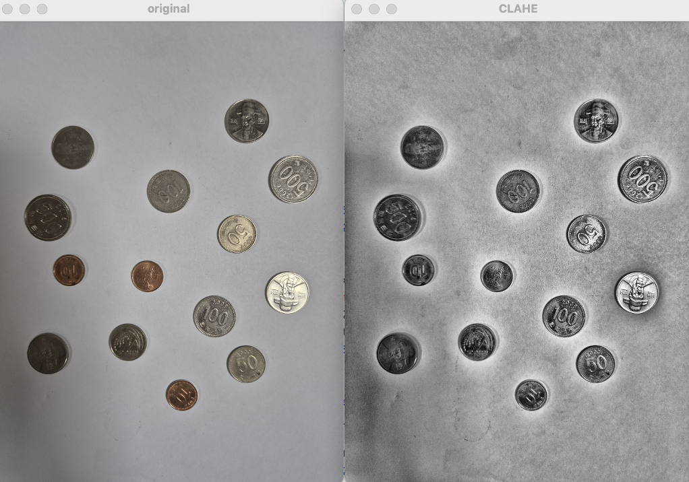
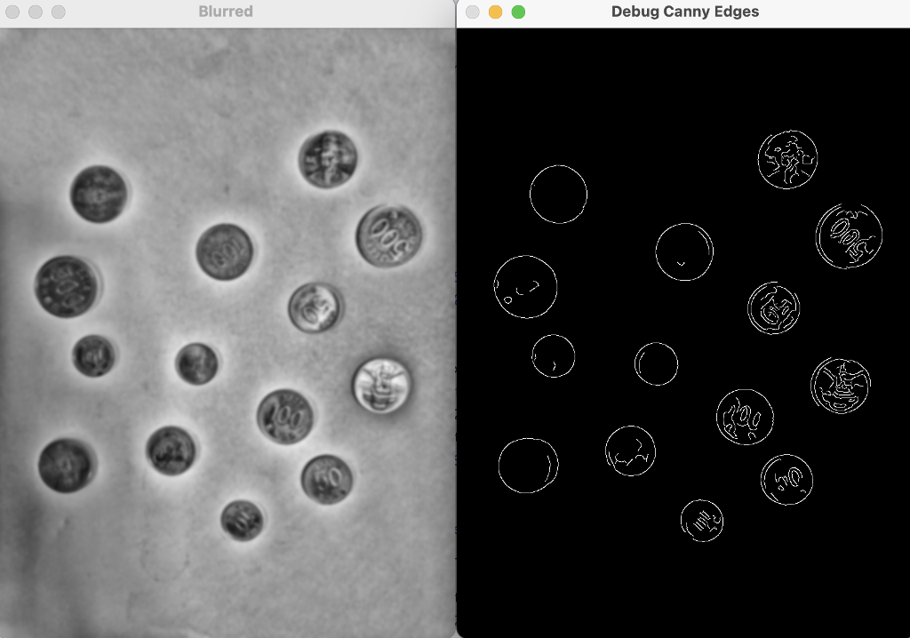
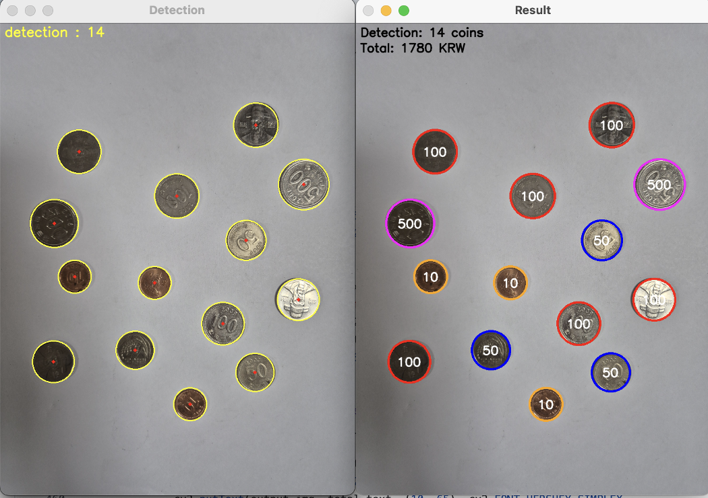
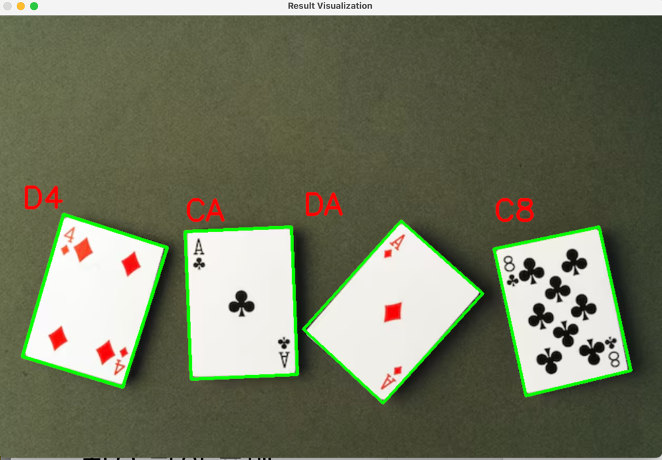
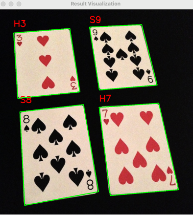

# OpenCV 프로젝트 모음

이 저장소는 OpenCV 관련 프로젝트들을 모아둔 공간입니다.

## 프로젝트 목록
- `coin-kr-handher0/` - 동전의 위치 검출 및 각 동전이 10원, 50원, 100원, 500원 중 무엇인지 식별
- `sort-playing-cards-handher0/` - 트럼프 카드의 Rank와 Suit 식별
- `n-tower-handher0/` - N seoul tower 식별 (사용 모델 : YOLOv8 Nano)
## 빠른 시작
각 프로젝트는 독립적으로 실행됩니다. 해당 폴더의 `requirements.txt`를 설치하고 `main.py`를 실행하세요.

예시:
```bash
cd coin-kr-handher0
python3 -m venv .venv
source .venv/bin/activate
pip install -r requirements.txt
python main.py --input path/to/image.jpg
```

***
# 동전 분류 수행 과정 스냅샷



디버깅 과정은 DEBUG_PREPROCESS = TRUE일 때 출력됩니다 (트럼프카드 포함)

# 카드 분류 수행 결과 스냅샷


